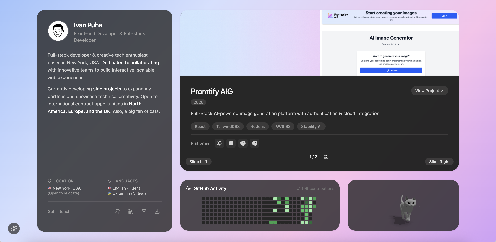
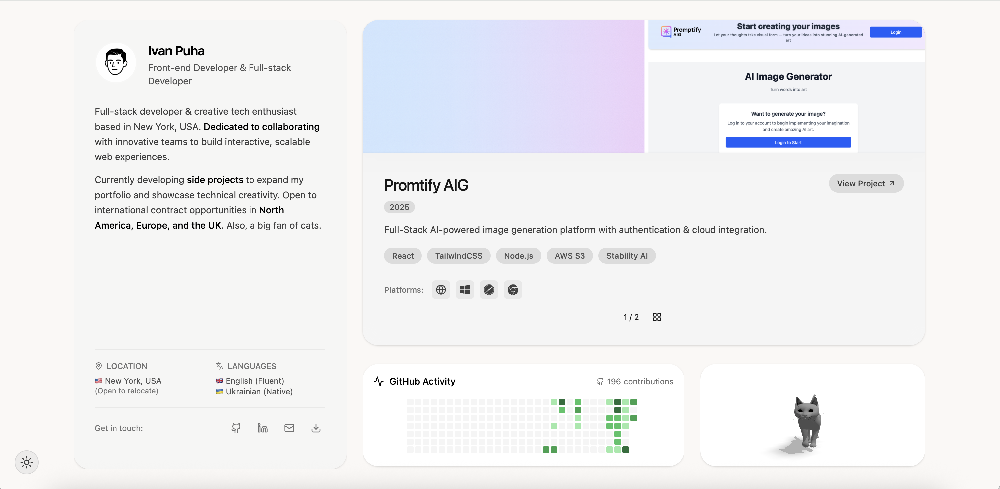
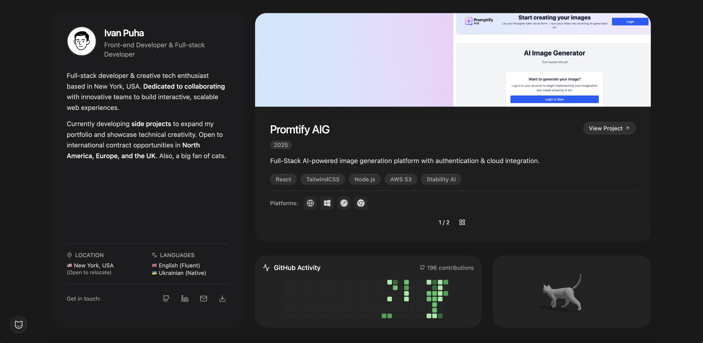

# 🌌 Ivan’s Portfolio

Welcome to my personal developer portfolio — a showcase of my work, experiments, and passion for building clean, interactive web experiences.  

---

## 🌐 Live Demo
👉 [ivanpuha.com](https://ivanpuha.com)

---

## 📸 Screenshots

<p align="center">
  
  
  
</p>

---

## 🚀 Features
- **Modern Tech Stack** → React + Vite + TailwindCSS + Framer Motion  
- **3D & Interactive** → Powered by Three.js / React Three Fiber  
- **Theming** → Light ☀️ | Dark 🌙 | Immersive ✨  
- **Performance Focused** → Optimized assets, lazy loading, responsive design  

---

## 🖼️ Projects
Some highlights you’ll find on the portfolio:

- **🖌️ AI Image Generator** → Generate, store, and explore images using AI models.  
- **🌍 Planets Awaken (3D Solar Experience)** → Scroll-based GSAP animations with 3D planets.  


---

## ⚡ Getting Started
Clone & run locally:

```bash
git clone https://github.com/puhaivan/portfolio-page.git
cd portfolio-page
npm install
npm run dev
``` 

---


## 📬 Contact
[LinkedIn](https://www.linkedin.com/in/ivan-puga/)
[Email Me](mailto:unsaightly@gmail.com)


## ✨ Thanks for visiting my portfolio! Feedback and collaboration ideas are always welcome. ✨
